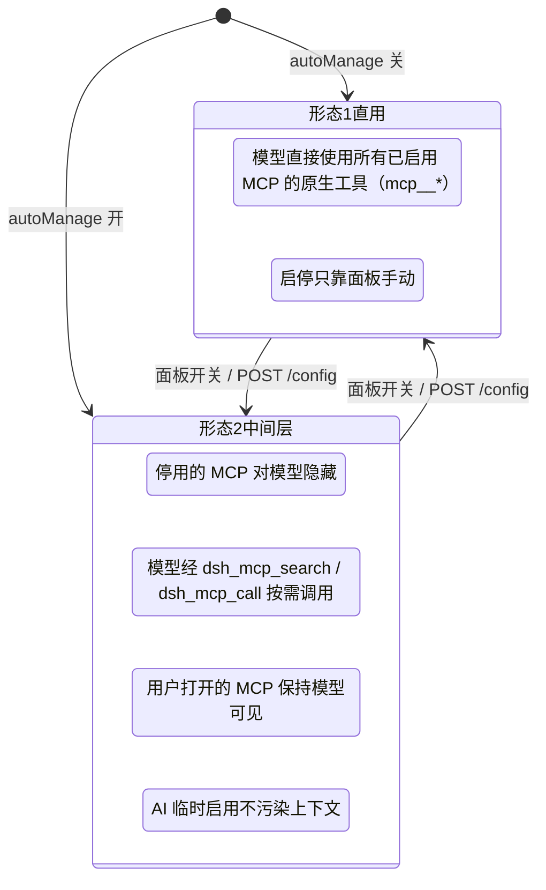
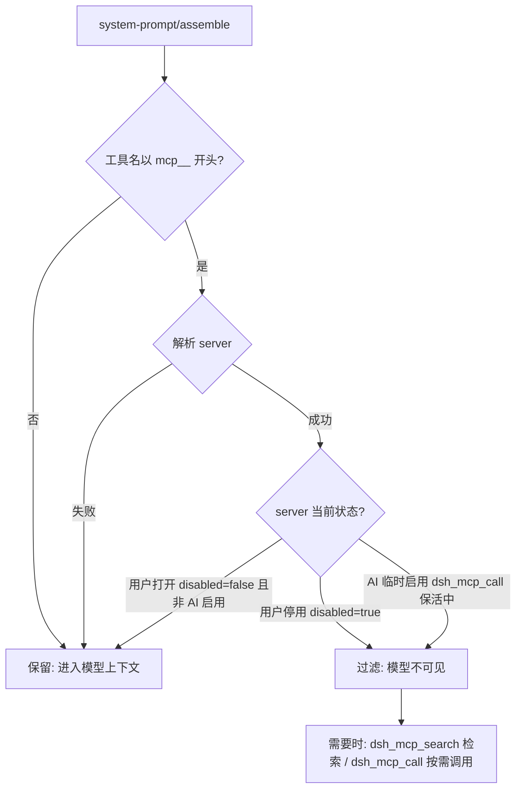
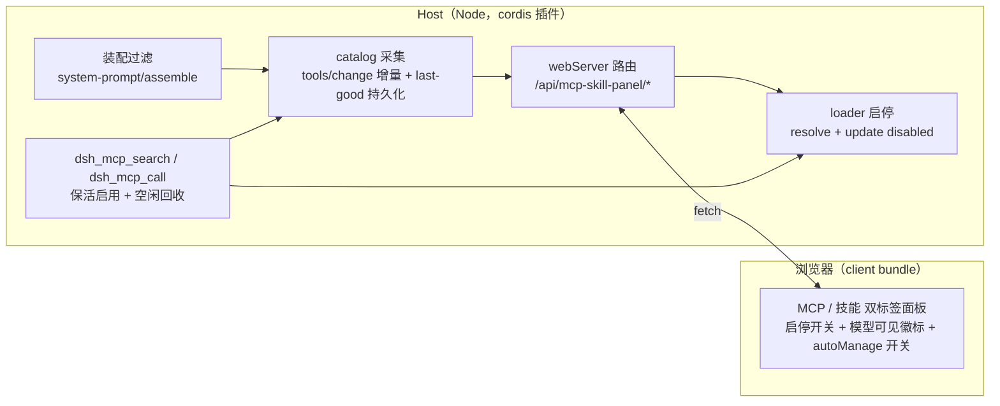
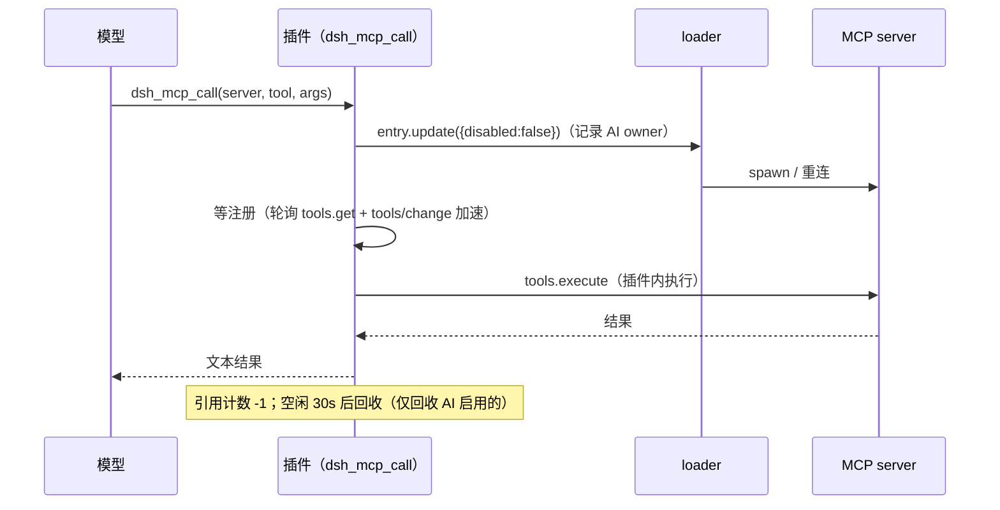

<p align="center">
  <strong style="font-size: 2.2em">🧩 MCP 与技能管理面板</strong><br>
  <span style="font-size: 1.1em">DeepSeek Harness（DSH）Web 插件 · MCP 服务器与 Skill 目录的实时启停 · 可选中间层（让AI按需调用）</span>
</p>

<p align="center">
  <a href="./README.en.md">🌐 English</a> · <strong>中文</strong>
</p>

<p align="center">
  
  
</p>

---

## ✨ 是什么

一个把 **MCP 服务器** 与 **Skill 目录** 变成可操作清单的设置页面板：每个条目一个启停开关，**停用即释放上下文占用，启用无需重启**。

还内置可选的 **AI 中间层**（`autoManage`）：开启中间层时，停用的 MCP 立即释放上下文，被中间层接管；模型需要 MCP 工具时，由中间层**临时开启** MCP，按需调用工具；用户手动打开的 MCP 全程对模型保持可见以维持高灵敏调用 —— 上下文占用完全由你的开关决定。


## 🎯 核心能力

| 能力 | 说明 |
| --- | --- |
| 🟢 **MCP 实时启停** | 停用 → loader entry 卸载（断开连接 + 注销全部 `mcp__<server>__*` 工具），工具从模型目录**立即消失**、schema token 即时释放；启用 → 重新连接 + 恢复工具，**无需重启** |
| 🧠 **Skill 启停** | 往 SKILL.md frontmatter 注入/移除 `disable-model-invocation: true`，模型 catalog 实时失效 |
| 📊 **停用态回填** | 停用的 MCP 卡片仍显示「目录中有多少工具、约多少 token」（来自私有 catalog 的 last-good 快照），决策是否启用更有依据 |
| 🤖 **AI 中间层（可选）** | `autoManage` 开启后：停用的 MCP 对模型隐藏，模型经 `dsh_mcp_search` / `dsh_mcp_call` 按需使用；用户打开的 MCP 保持模型可见；AI 临时启用不污染上下文 |
| 🔒 **用户启停不被模型干预** | 回收器只回收「AI 从停用态临时启用」的 server；用户手动打开的 server 永不被自动关闭 |
| 💾 **重启保持** | 启停意图持久化（`~/.dsh/dsh-mcp-skill-panel/state.json`）并在启动早期物化进预设组合文件；catalog 快照（`catalog.json`）重启后仍可回填 |
| ⚡ **响应快** | 开关点击即翻转（乐观更新 + 服务端确认），分域缓存 + 事件驱动失效（`tools/change` / `skills/change`），MCP 页不触发 skill 目录扫描 |
| 🌐 **双语界面** | 全部文案 zh/en 双语，跟随 DSH 界面语言；明暗主题适配 |
| 🪶 **零上下文占用** | 插件自身不注册任何模型工具，不消耗模型注入面（开关关闭时与未安装无异） |
| ⏱️ **生效时机选项** | 手动开关可选「立即生效」或「下次会话生效」，后者零缓存失效、零额外费用；AI 中间层按需调用始终不触发缓存 miss |
| ➕ **快速迁移添加** | 面板粘贴其它 harness 的 `mcpServers` JSON（Claude Code / Codex 等）→ 转换预览 → 一键添加为全局（写入 profile patch）或项目（`.dsh/mcps/mcp.json`）；`type/transport` 自动推断、`${VAR}` 环境变量自动插值 |
| 📁 **项目级 MCP** | 读取 `<工作空间>/.dsh/mcps/**/mcp.json`（根目录先读、子目录按 serverName 覆盖），**仅该项目工作空间的会话可见**（按会话 cwd 过滤）；文件改动热更新 |
| 🛠️ **工具级禁用** | 在 server 级启停之上按工具精确控制：被禁工具从 `dsh_mcp_search` 检索结果过滤、`dsh_mcp_call` 直接拒绝；项目 MCP 按工作区作用域隔离（A 区禁用不影响 B 区） |
| 🧮 **工具级批量启停** | `POST /mcp/toolBulk` 一次读-改-写落整批（不写 N 次盘）：`toolNames` **三态** —— 省略=该 server 当前目录里的全部工具 / 数组=精确集合（`[]` 为空操作）/ 非数组、或非空却 0 命中=400（不静默降级成「全部」，也不静默 no-op）；响应含 `ignoredToolNames`，把「点名了但不在当前目录」的项回传，目录漂移可见化 |
| 📈 **有效统计** | 工具数 / token 数同时给「目录总数」与「**工具级启用数**」：面板按与装配过滤同源的谓词（`isToolDisabled` + 会话工作区）复算，禁用 400 个工具后不再仍显示 450。**口径边界**：只扣「工具级禁用」，**不**覆盖 server 级隐藏（AI 临时启用 / `middleLayerHides='all'`）与 project-mcp 工作区过滤 |
| 🎯 **工具预算** | `toolBudget` 设一条工具数红线（如 350），超线卡片变红；比较对象是**全部工具**（含 read/edit/bash/skill 等非 MCP 工具），数据源优先请求面真值 —— `toolsAllSource='request'`（会话上一次已落盘请求的装配后工具表），取不到时回退注册表 `'registry'`，且口径来源**在卡片上标注**（注册表口径是近似值，不得混同） |
| 🧭 **AI 中间层按模型分流** | `autoManageByRoute`：按 `provider` 或 `provider/model` 分别开中间层；查表序 `provider/model` → `provider` → `autoManage` 总开关。覆盖项为真时即使总开关关也会挂载中间层（被覆盖的模型可用 `dsh_mcp_search` / `dsh_mcp_call`），其余模型维持直用形态 |
| 🙈 **`middleLayerHides`** | 中间层隐藏范围，默认 `'disabled'`（只隐藏停用的 server）；`'all'` 时**连已启用的 server 也从模型装配面隐藏**，模型统一改经中间层取用 —— 只改「本次装配的可见性」，工具注册表与 `dsh_mcp_call` 执行通道不受影响 |
| 🪄 **创建技能** | 面板填写名称/描述/指令即可创建技能（全局 `~/.dsh/skills` 或项目根 `.dsh/skills`），可上传 SKILL.md 自动解析 frontmatter 预填，创建后立即可见 |

## 🧾 配置项

面板可写的配置落在 `~/.dsh/dsh-mcp-skill-panel/state.json`（优先于 cordis `config`），可用 `GET/POST /config` 读写：

| 配置项 | 取值 | 说明 |
| --- | --- | --- |
| `autoManage` | `false`（默认）/ `true` | AI 中间层总开关（形态 1 ↔ 形态 2） |
| `applyMode` | `immediate`（默认）/ `next-session` | 手动开关的生效时机（见「生效时机」一节） |
| `toolBudget` | 正整数 / 空 | 工具数红线：**全部工具**（含 read/edit/bash/skill 等非 MCP 工具）超过它即告警；空 = 不提示。数值只是可配置默认值，见「已知限制」 |
| `autoManageByRoute` | `{ "<provider>": bool, "<provider>/<model>": bool }` | 中间层**按模型分流**；查表序 `provider/model` → `provider` → `autoManage` 总开关。经 `POST /config` 的 `routeOverride: { key, value }` 单条增删（`value: null` = 删除该键）；任一覆盖项为真即挂载中间层 |
| `middleLayerHides` | `'disabled'`（默认）/ `'all'` | 中间层隐藏范围：`'disabled'` 只隐藏停用的 server；`'all'` 连已启用的 server 也从模型装配面隐藏 |

## 🏗️ 两种形态（面板上的「AI 中间层」开关）



形态 2 的装配过滤（每回合实时判定）：



**工具级禁用（v0.5.3+，常开）**：除上述 server 级过滤外，被禁用的单个工具从装配结果剔除、`dsh_mcp_search` 检索结果过滤、`dsh_mcp_call` 直接拒绝并提示「请在 MCP 管理面板打开该工具后再调用」；禁用集合持久化在 `state.json`，重启保持。

## ⏱️ 生效时机：立即生效 vs 下次会话生效

面板为手动开关提供「生效时机」选项（位于开关旁的下拉菜单），两档：**立即生效**（默认）和 **下次会话生效**。理解两者区别对 Prompt Cache 费用有直接影响。

### 手动开关的两种模式

- **立即生效**（默认）：切换在**下一轮对话**即生效，该轮起工具前缀变更 → **前缀 KV-Cache 100% 失效**，该轮按 miss 费率计费（约为 hit 的 **5 ~ 12.5 倍**）。适合需要马上释放/恢复上下文的场景。

- **下次会话生效**：仅记录意图，当前会话全程工具集不变 → **零缓存失效、零额外费用**。直到以下边界之一到来才真正应用：
  - 新会话首次请求前（`agent/session-start` 阶段）；
  - DSH 重启（启动早期 `syncPresetFiles` 物化到预设组合文件）。

  面板提供 **「立即应用待生效变更」** 按钮，作为"已知晓费用"的强制生效出口——点击后立即生效（等同于选择"立即生效"并应用）。

### AI 中间层按需调用：天然免缓存失效

开启 AI 中间层（`autoManage`）后，模型经 `dsh_mcp_search` / `dsh_mcp_call` 按需调用已停用的 MCP——这种临时启用**不会造成缓存 miss**。原因：每回合的装配过滤（`system-prompt/assemble` Waterfall）让临时启用的 server 工具对模型保持不可见，前缀恒定，KV-Cache 持续命中。

### 默认值与生效边界

| 项目 | 说明 |
| --- | --- |
| 默认值 | `immediate`（维持历史行为） |
| 选择 `next-session` | 需在面板显式切换 |
| 生效边界 | 新会话首次请求前 + DSH 重启 |
| 当前会话 | 已开会话的后续轮次不受影响 |

### 一句话结论

> 想省费用又不急着释放上下文 → 用 **下次会话生效**；要当前会话立刻释放/拿回工具 → **立即生效**（理解该轮会 miss 一次缓存）。

## 📦 安装

```sh
dsh plugin --profile web add "github:reamerit/dsh-mcp-skill-panel#main"
```

> 桌面端：**不要**用 `dsh plugin --profile desktop add`（Desktop 2.x 明确禁止该通道），
> 请在「设置 → 插件」或 dshmarket 里安装。

产物已入库（`lib/`），git 源一行安装，无需构建授权。安装后**重启 `dsh web`**（bundle 层在启动时合成，热更新无效），设置页即出现「MCP 与技能管理面板」入口。

> 🎯 **适配 DSH `0.1.5-rc2` ~ `0.2.0-rc2`**（含桌面端）。低于 `0.1.5-rc2` 请先升级 DSH；`0.2.0` 起 preset 不再落盘，面板改从 standing 树直读（见「0.2.0 数据源迁移」）。

> 📦 已发布到 **npm**：`dsh-mcp-skill-panel`（[npm 页面](https://www.npmjs.com/package/dsh-mcp-skill-panel)）。npm 版为预构建产物，安装可跳过 `allowBuilds` 构建授权，也可直接以包名安装；git 源方式始终可用。
>
> ⬆️ **升级**：git 源用户请在 DSH profile 目录执行 `pnpm update dsh-mcp-skill-panel`（`pnpm add` 对相同 spec 不会重解析 git 分支）；npm 用户 `pnpm add dsh-mcp-skill-panel@latest` 即可（版本以 `npm view dsh-mcp-skill-panel version` 为准）。npm 发版**可能滞后于仓库**（0.5.4 / 0.5.5 曾发布后撤下），最新代码以**仓库**（git 源）为准。
>
> 🔁 **更新插件后必须重启 DSH**（与安装同理，bundle 层只在启动时合成）：只 `pnpm update` 而不重启时，浏览器已加载新客户端、宿主进程仍是旧代码（没有 `/models` 路由 → 404），覆盖卡会显示「端点未注册（更新插件后需重启 DSH）」的降级提示。**这是预期状态**，重启即恢复，不必排查网络或面板令牌。

## 🚀 使用

1. 设置页 → **MCP 与技能管理面板**
2. **MCP 服务器** 标签页：每张卡片显示服务器名、状态徽标（运行中 / 已停用 / 无工具 / 异常）、**模型可见徽标**（中间层模式下用户打开=可见，停用/AI 临时=隐藏）、工具数与 token 占用估算；点右上角开关启停；MCP 行可**展开工具列表逐个禁用**（工具级禁用）
3. **技能** 标签页：每张卡片显示技能名、来源、描述、模型可见徽标；点右上角开关启停
4. **AI 中间层开关**：开启后停用的 MCP 由模型按需调用（见上节形态说明）；关闭回到经典模式
5. **添加 MCP / 创建技能**：MCP 页右上「添加 MCP」粘贴 `mcpServers` JSON 后可选全局/项目；技能页右上「创建技能」填名称/描述/指令（可上传 SKILL.md 自动预填）
6. **手动管理**（可选）：直接编辑预设组合文件（`disabled: true` 行）或 SKILL.md frontmatter（`disable-model-invocation: true`），下次重启/变更即生效；被外部修改的行会退出插件管理（下次启动尊重你的改动）

> 状态徽标含义：🟢 运行中（有工具）/ ⚪ 已停用 / 🟡 无工具（进程在跑但工具列表为空，多为 server 启动失败或空实现）/ 🔴 异常（未在运行也未停用）。

## 🔌 HTTP API

前缀 `/api/mcp-skill-panel`（旧前缀 `/api/runtime-inventory/*` 仍兼容）。

| 方法 | 路径 | 说明 |
| --- | --- | --- |
| GET | `/state?session=<id>&part=<mcp\|skills\|all>` | 清单快照；`part` 分域拉取，缺省 all |
| POST | `/mcp/toggle` | `{ entryId, disabled }` 启停单个 MCP |
| POST | `/mcp/toggleBatch` | `[{ entryId, disabled }]` 批量启停（400ms 合并，单次失效） |
| POST | `/mcp/applyPending` | 立即应用待生效队列（next-session 意图强制生效）；**需 body `{ confirm: true }`**，缺了即 400（该操作会让当前会话下一轮 100% miss 前缀缓存，故要求显式确认） |
| GET\|POST | `/mcp/rowConfig` | body `{ server, set?, unset?, apply? }` 读/写某 MCP 行的挂载配置（`command`/`args`/`env`/`cwd`/`url`/`headers`…）；GET **开放但 env/headers 脱敏回显**，POST **需 `x-panel-token`**；写侧占位符即「保留原值」 |
| GET\|POST | `/debug/rowConfig` | GET 只读取某 server 行的全量挂载配置 + 模块身份读数（运维排障用；env/headers 脱敏回显）；POST 为取证用写入（body `{ server, set?, unset?, update? }`，`update:false` 即 dry-run 只回报 `willWrite`，不碰运行时） |
| POST | `/mcp/toolToggle` | `{ serverName, toolName, disabled }` 工具级禁用（全名 `mcp__<server>__<tool>`） |
| POST | `/mcp/toolBulk` | `{ serverName, disabled, toolNames?, session? }` 工具级**批量**启停。`toolNames` **三态**：省略/缺字段 = 该 server 当前目录里的全部工具；数组 = 精确集合（`[]` 为合法空操作，200 + `changed:0`）；**非数组**、或非空却**一条都不匹配** → 400（不静默降级为「全部」）。目录不可得（从未启动且无快照）同样 400。响应 `{ serverName, disabled, disabledTools, disabledCount, changed, ignoredToolNames }`：`ignoredToolNames` = 点名了但不在当前目录视图里的项（60s 缓存可能已过期，据此察觉「以为动了 N 条、实际只动交集」） |
| POST | `/mcp/preview` | `{ json }` 快速迁移预览：粘贴 mcpServers JSON → 解析 + YAML patch 转换（返回 warnings） |
| POST | `/mcp/add` | `{ json, target: global\|project, workspace? }` 添加 MCP（全局写入 profile patch / 项目写入 `.dsh/mcps/mcp.json`） |
| POST | `/skill/toggle` | `{ name, disabled }` |
| POST | `/skill/add` | `{ name, description, body, target: global\|project, workspace? }` 创建技能 |
| GET | `/config` | 读取中间层与面板配置：`autoManage` / `applyMode` / `autoManageByRoute`（按模型覆盖表）/ `autoManageMounted`（中间层当前是否挂载）/ `middleLayerHides` / `toolBudget` |
| GET | `/models` | provider/模型目录（数据源 = 宿主 llm 服务）+ `active` 路由投影：`providers`（`{ provider, name, models[] }`，按 provider 字典序）/ `autoManage` / `autoManageByRoute` / `autoManageMounted` / `active`（`on` + `source` 四取值 `'model'`\|`'provider'`\|`'master'`\|`'no-route'` + `provider`/`model`）/ `session` / `cached`（本次直接取自 TTL 缓存）/ `fetchedAt`。`listModels` 会逐个 provider 打到 adapter（可能触达网络），故 **60s TTL + 单飞**（`MODELS_TTL_MS = 60_000`；并发请求共享同一在飞抓取）把这条**无鉴权读端点**的扇出上界锁死为 60s 一次；三条降级路径都不抛（`llm` 缺失 / `listProviders()` 抛错 → `providers: []`；单个 `listModels()` 抛错 → 只该 provider `models: []`） |
| POST | `/config` | `{ autoManage?, applyMode?, toolBudget?, middleLayerHides?, routeOverride? }` 写配置并持久化到 state.json。`toolBudget`：`null`=清除，只接受 >0 的有限数；`middleLayerHides`：`'disabled'`\|`'all'`；`routeOverride`：`{ key: '<provider>' \| '<provider>/<model>', value: boolean \| null }` 单条增删按模型覆盖（`null`=删除该键）。仅 `autoManage` / `middleLayerHides` / `routeOverride` 触发中间层重挂（`tools/change` → 该轮前缀缓存 miss） |
| GET | `/debug` | catalog 采集诊断 + scope 解析现场（scopeDiag），运维排障用 |
| POST | `/debug/collect` | 手动触发一次 catalog 采集 |
| GET | `/token` | 取本进程随机令牌（面板 POST 前自动获取并携带 `x-panel-token` 头） |

> **写操作鉴权（0.4.7+）**：全部 POST 要求 `x-panel-token` 头与本进程随机令牌一致，否则 401 —— 阻断跨源 / DNS-rebinding 对本地控制端点的盲写；GET 只读端点（state/config/debug/token）保持开放。令牌由客户端在 `/token` 获取并自动携带。
> 分域缓存（60s TTL 兜底）由事件驱动精确失效：`tools/change` / `loader/partial-dispose` → MCP 域；`skills/change` → Skill 域。

## ⚙️ 工作原理



**MCP 启停**：MCP 行是 agent preset 组合（`agent.cordis.yml`）中的 loader entry（`@deepseek-ai/dsh-mcp-client`，完整 id 形如 `include:agent-presets:mcp-cheatengine`）。`loader.resolve(id).update({ disabled })` 实时 dispose/restart 该 entry。

**MCP 持久化为何分两步**：预设树（`PresetTree`）的 `write()` 是显式 no-op，且 `dsh-agent-presets` 用 `{mtimeMs, size}` stamp 检测预设文件变化 —— **运行期写该文件会触发 standing 重挂而旧实例不清理**（serverName 全冲突、会话创建失败，0.1.0 实测事故）。因此 toggle 只写插件状态文件，插件 `apply`（启动早期、standing 未挂载）时再把意图物化到预设文件。

**中间层调用链**（`dsh_mcp_call` 对停用 server）：



> **tool 参数契约（0.5.1+）**：`dsh_mcp_call` 的 `tool` 应传该 server 上的**裸名**（如 `understand_image`）；误传 `dsh_mcp_search` 返回的注册全名（`mcp__<server>__<tool>`）或双重前缀会自动归一化，其他 server 的注册全名立即快速失败并提示。

> **控制工具名（0.6.0 起）**：两个控制工具为 **`dsh_mcp_search`** / **`dsh_mcp_call`**（旧名 `mcp_search` / `mcp_call` 已弃用 —— 上游网关把 `mcp_` 前缀当 MCP 工具解析并返回 400）。本页变更日志条目与 `decisions/`、`docs/*patch-notes*.md` 等历史留档中的旧名是当时的记录，未改写。

**catalog 采集**：`tools/change` 事件（root 监听，150ms 去抖）对 enabled server 增量快照；scope 解析经 `agentPresets.standingKeyFor()` 兜底并**进程级共享缓存**（v0.5.3，HTTP 面板路径与快照路径复用同一 key）；空快照不覆盖磁盘 last-good；`catalog.json` 原子写回（tmp + rename，0600）。

## ✅ 验证清单

| 检查项 | 操作 | 预期 |
| --- | --- | --- |
| 面板入口 | 重启后打开设置页 | 出现「MCP 与技能管理面板」，MCP/技能双标签，zh/en 跟随界面语言 |
| MCP 停用 | 关掉一个服务器开关 | 卡片变「已停用」，新会话工具列表不再含 `mcp__<server>__*`；停用态仍显示目录工具数 |
| MCP 启用 | 再打开开关 | 工具恢复，**无需重启** |
| 持久化 | 停用后重启 dsh | 该服务器仍处于停用状态 |
| Skill 启停 | 点技能开关 | 卡片立即翻转且不回跳；模型目录同步移除/恢复 |
| 外部变化 | 会话 A 停用某 MCP，会话 B 打开面板 | 无需点刷新即为最新状态 |
| AI 中间层 | 面板开 autoManage | 停用 server 对模型隐藏、`dsh_mcp_search`/`dsh_mcp_call` 可用；用户打开的 server 带「模型可见」徽标 |
| 回收保护 | 模型 dsh_mcp_call 后空闲 30s | AI 临时启用的 server 自动停用；用户手动启用的不被回收 |
| 工具级禁用 | 展开 server 工具列表关掉一个工具 | `dsh_mcp_search` 不再返回该工具；`dsh_mcp_call` 拒绝并提示；重启后保持 |
| 更多配置 | 点某行「更多配置…」改 `cwd` 等字段 | 热应用即时生效（子进程重启）；**重启 dsh 后**该字段出现在预设行 `config:` 块，且 live 从文件读回该值 |
| 未注册告警 | 让一个启用行的子进程起不来（如 codegraph 缺索引） | 卡片徽标显示「未注册工具 / Not registered」，`tools` 显示 0 而非目录快照值，悬停有说明 |
| 添加 MCP | 粘贴 mcpServers JSON → 预览 → 添加 | 全局写入 profile patch / 项目写入 `.dsh/mcps/mcp.json`，面板即时出现新行 |
| 创建技能 | 技能页「创建技能」 | 落盘 `~/.dsh/skills` 或项目 `.dsh/skills`，技能列表即时出现 |

## ⚠️ 已知限制

- 启停作用于 preset 层：一个服务器/技能的开关影响该 preset 下所有会话。
- **0.2.0 起 preset 不落盘**：面板数据源改为 standing 树直读，state.json 的行来源键由「预设文件路径」变为 `preset:<presetId>`（旧键在首次写入后自然废弃，`syncPresetFiles` 对非文件键是 no-op）。此时**「手动编辑预设文件」这条交互不存在**（没有文件可编辑），外部改动检测随之退化为「live 事实 vs 记录值」。
- **模块实例身份仍是硬约束**：`livePresetMounts()` 的挂载表是 agent-presets 包内**模块私有** Set，本插件必须解析到宿主同一份物理实例才能看到挂载。解析基准优先 `ctx.baseUrl`，另有 `standingMountFor` 捕获兜底；判读面见 `/debug` 的 `standingDiag.presetApi`。
- 无 frontmatter 的 SKILL.md 无法切换（provider 本身会忽略此类文件）。
- 工具数/token 为估算值（`JSON.stringify(parameters).length / 4`），与模型注入面真实值近似。
- 停用后工具立即消失，但**当前回合的请求缓存**（如有）可能仍引用旧 schema；下一请求自然刷新。
- **持久化时滞**：启停实时生效；跨重启保持依赖下次启动的物化 —— 插件在「已有会话运行」期间被热更新时，本次进程不物化，下一次重启生效。
- **手动编辑预设组合文件的 mcp 行**（如手动移除 `disabled: true`）会令该行退出插件的**启停持久化管理**（下次启动尊重你的改动，不再写 `disabled`）；但**配置意图（「更多配置」改的字段）仍会继续物化**，两者是正交字段。
- **未注册 ≠ 未启用**：`status=failed / tools=0 / unregistered=true` 表示该行**已启用且在跑**，但子进程一个工具都没注册（多为配置问题：缺项目索引、端点不可达、可执行文件不存在）。卡片下方列出的工具来自目录快照，只是"可被 `dsh_mcp_search` 检索"，不代表当前可用。
- **工具级禁用边界**：禁用拦截作用于模型可见性（装配过滤）、`dsh_mcp_search` 检索与中间层 `dsh_mcp_call`；对已注册工具的直接原生调用（绕过中间层）不做运行时拦截。
- **有效统计是「工具级启用数」，不等于「实际进入上下文」**：它只扣「工具级禁用」（谓词与装配过滤同源）。**口径边界**：不扣 server 级隐藏（`dsh_mcp_call` 保活中的 AI 临时启用 server、`middleLayerHides='all'` 下的全部 server），也不扣 project-mcp 的工作区过滤 —— 它回答的是「该 server 有多少工具处于启用态」，不是「模型这一回合实际看到多少」。
- **工具预算的上限数字只是可配置默认值/示例**：`toolBudget` 与面板输入框占位符里的数字（如 Grok 350）是**示例值/默认提示**，不是对任何 provider 的真实断言或硬约束（各家上限随模型与账号变化，请按实测填）。预算比较用的「全部工具数」是**请求面口径优先**：`toolsAllSource='request'`（会话上一次已落盘请求的装配后工具表，有一轮延迟）；取不到时回退注册表口径 `'registry'` 并在卡片上标注来源，后者不扣 server 级隐藏与项目工作区过滤，是近似值。
- **控制工具的 `arguments` 必须是 JSON 对象**：`dsh_mcp_call` 的 `arguments` 声明为对象类型，**字符串形态会被参数校验前置拒绝**（报 `invalid arguments: "arguments" must be an object`）。这是有意的收紧（0.6.0 起）—— 旧版会把 JSON 字符串透明解析，现在按工具描述要求的对象形态传入即可。
- 运行期写 SKILL.md 安全（skill-filesystem 的 watcher 本就预期文件被改）；运行期写预设组合文件会触发 dsh-agent-presets 的 stamp 重挂事故，插件刻意不做。
- 能力摘要表（`dsh_mcp_search` 空查询）只覆盖有 catalog 快照或配置了 `serverSummary` 的 server；从未成功启动过的 server（如 codegraph）不会列出。**口径提示**：`middleLayerHides='all'` 时该表按「经中间层取用」表述，不再宣称 server「对模型可见」—— 可见与否以装配结果为准（此时连已启用的 server 也从模型面隐藏）。
- **按模型覆盖的数据源（v0.6.0 补齐）**：面板**会**拉 provider/模型目录（`GET /models`，**60s TTL + 单飞**）—— 「无鉴权读端点不该把每次请求都放大到 adapter」仍是这条缓存的理由，但不再是「不拉目录」的理由。覆盖卡的行集合 = **可折叠的目录**（provider 行 + 模型行）∪ 其它已存在的键（运行期 ∪ 持久化（`autoManageByRoutePersisted`）；未被目录吃掉的键落在「其它键」区），因此**可以为任意 provider/模型预置规则，不必先切到它**；目录拉取失败时降级为「只列键」的旧行为，键照旧全部可见、可删（挂载失败后运行期表被清空的键，按「已保存，未生效」标注）。目录只影响**可点范围**，不影响 gate 语义（查表序 `provider/model` → `provider` → `autoManage` 与生效判定原样）。**会话口径（0.6.0 会话透传）**：面板**可用时**把当前会话一并带上（`/state`、`/models` 带 `?session=`；`/skill/toggle`、`/mcp/toolBulk` 带 body 的 `session`），host 就按该会话解析 —— 高亮、`toolsAll*` 计数、preset/cwd 等**随会话的读数**跟随你正在用的那个会话（**解析成功时**：卡片以 host 回显的 `sessionId` 为准，措辞据此在「跟随当前会话」/「面板绑定会话」之间切换）。注意 per-server 的 tools/tokens 聚合走**进程级** standing scope，不随会话。两个写端点用的是该会话的**作用域**：`/skill/toggle` 据此决定改哪个技能域（同名技能在不同会话下可能落到不同文件），`/mcp/toolBulk` 据此把工具名解析成实际目标。**取不到会话时**（宿主未提供该能力）请求与旧版**逐字节相同**，host 仍按 `roots[0]` 解析（见下条）。
- 面板是**进程级全局**设置区块：**可用时**它会带上当前会话（0.6.0 会话透传，见上条），高亮与随会话的读数（`toolsAll*` 计数、preset/cwd）跟随你正在用的会话（**解析成功时**，以 host 回显的 `sessionId` 为准）；**取不到会话时**才回退旧行为 —— `/state` 不带 `session`，host 侧按 `roots[0]` 解析归属会话。两种情形下卡片都会把 host 回显的 `sessionId`（没有则 `—`）显示出来供核对。
- **控制端点鉴权**：写操作由进程级随机令牌（`x-panel-token`）保护，仅面板同源客户端自动携带；GET 只读开放。宿主 webServer 本身无鉴权层，若将监听地址改为 `0.0.0.0` 对外暴露，建议同时依赖外层网络隔离。

## 🛠️ 开发

依赖已**自包含**（`@deepseek-ai/*` 构建期依赖全部并入 devDependencies，纯 registry 安装即可，**无需本机 DSH 闭包**）：

```sh
npm install --legacy-peer-deps --ignore-scripts   # 一次即可（旧流程的 npm run setup / junction 不再必需）
npm run typecheck  # tsc 类型检查（@deepseek-ai devDeps 提供 Context 服务类型增补）
npm run build      # tsdown（node external 全部 @deepseek-ai/*）→ 最后 tsc 生成 lib/types（顺序不可换）
npm run verify     # 产物验证（无 TOOL_RUNTIME_SCHEDULER 内联、client 包装完整、lib/types 齐全、row-display 产物存在性 + 零 import 闸门）
npm run selftest:rowconfig  # preset 文本 / rowConfig 纯逻辑单测
npm run selftest:mcp        # catalog / convert / preset 纯逻辑单测（含 computeStatus 等回归）
npm run selftest:pending    # P1 会话边界应用链单测
```

**0.2.0 宿主真机验收**（可选，需要本机装了 DSH Desktop / 有 app.asar）：

```sh
npm run verify:host020
# app.asar 位置会自动探测；非标准安装位置用 DSH_ASAR 显式指定：
# DSH_ASAR="C:\...\resources\app.asar" npm run verify:host020
```

它从 app.asar 里解出**宿主真实现**并断言 5 组事实：兼容门放行本 manifest、
旧包名在 0.2.0 上不可解析（原 bug 现场）、registry 导出两个读取口、
`lib/index.js` 在 0.2.0 运行时下可加载、产物里已无 agent-presets 静态 import。
（不用复刻 semver 来"验证"自己 —— 复刻等价实现做自证等于自我欺骗。）

> **lib/ 产物由 GitHub Actions 自动重建**（`.github/workflows/build.yml`）：提交源码后推送，CI 跑 typecheck→build→verify→selftest，在 main 分支把新 `lib/` 以 `[skip ci]` 提交回写；本地记得 pull 收产物。
> 为什么 `--legacy-peer-deps`：运行时 peer 由 DSH 闭包注入，而 registry 上 rc.6~rc.8 的 peer 声明互相咬（ERESOLVE）；为什么 `--ignore-scripts`：esbuild 走 optionalDependencies 平台二进制、无需 postinstall。

node 半区 tsdown 必须 `external: [/^@deepseek-ai\//]`：内联 dsh-tools 会产生第二个 `TOOL_RUNTIME_SCHEDULER` Symbol，导致工具调度崩溃（dsh-context-doctor 同款教训）。
`build.mjs` 的顺序必须是「tsdown → tsc dts」：tsdown 的 `clean` 会清掉 `lib/`，若先 tsc 生成、后 tsdown，`lib/types` 会被连带删除（0.4.7 修复，verify 有护栏）。

## 📋 变更日志

### v0.7.0（2026-10）— DSH 0.2.0 适配（数据源迁移）+ 桌面端可安装

> 触发场景：在 **DSH Desktop 0.2.0-rc.2** 上安装本插件时，桌面插件管理器直接拒绝：
> `installation rejected: Plugin dsh-mcp-skill-panel@0.6.0 is incompatible with dsh 0.2.0-rc.2:
> peerDependencies {"@deepseek-ai/dsh-scope":"^0.1.2-rc.1"}`。
> 绕过版本门也没用 —— 0.2.0 的模块图里旧包名根本不存在。

#### 🔴 两个各自独立的阻断点

| # | 症状 | 根因 |
| --- | --- | --- |
| ① | 插件管理器拒绝安装 | 0.2.0 新增插件兼容门（`dsh-app-boot` 的 `evaluatePluginCompatibility`）：把插件**每一个** `@deepseek-ai/dsh*` peer 与运行时做 semver 比对。`^0.1.2-rc.1` 对 `0.2.0-rc.2` 不满足（0.x 的 `^` 只允许 `0.1.x`） |
| ② | 即使放行安装也会崩 | `src/standing-rows.ts` 顶部**静态** `import * as agentPresets from '@deepseek-ai/dsh-agent-presets'` —— 0.2.0 把该包拆成 `dsh-agent-preset`（纯插件）+ `dsh-agent-preset-registry`（服务与读取口），旧包名**不存在** → 模块图加载期 `ERR_MODULE_NOT_FOUND`，插件内部的 try/catch 降级设计来不及生效 |

#### 🔧 修法一：模块解析改为运行期动态解析（`agent-preset-compat.ts`，新增）

- 静态 import 改为 `createRequire` 按顺序解析两个候选包名（**新名优先**，旧名仅作 0.1.x 回落）。
- 解析基准优先取 **`ctx.baseUrl`** —— 宿主挂载 preset 走的是
  `mountPreset(scope.ctx.extend({ baseUrl: record.context.baseUrl }), …)`
  （registry `lib/index.js:534`），用同一基准建 require 才落在宿主**同一份物理实例**上。
- ⚠️ **为什么实例身份是硬约束**：`livePresetMounts()` 背后是包内**模块私有**
  `const mounts = new Set()`（0.1.2-rc.1 `lib/index.js:695`、0.2.0-rc.2 `lib/index.js:78`），
  没有 `globalThis` / `Symbol.for` 之类的跨实例通道（实测两份拷贝的
  `livePresetMounts !== livePresetMounts`）。解析错实例不报错，只是**静默返回空表**。
- 双保险：`captureStandingMount()` 在 `apply` 里经模块级
  `standingMountFor(agentCtx)` 捕获一份挂载；`standingMounts()` 首选
  `livePresetMounts()`，空则并入捕获的挂载。
- `/debug` 的 `standingDiag.presetApi` 新增取证面（命中的包名 / 实例路径 / 解析基准 / 失败清单）。

#### 🔧 修法二：数据源迁移 —— 从「preset 文件文本」改为「standing 树直读」（`preset-live.ts`，新增）

0.2.0 不只改名，还把插件赖以工作的**文件面整个砍掉**：

| 插件原本依赖 | 0.1.2-rc.1 | 0.2.0-rc.2 |
| --- | --- | --- |
| `ctx.agentPresets.standingKeyFor()` | ✅ | ❌ 已删除（改 `acquireScope()` 返回带 dispose 的租约） |
| `ctx.agentPresets.resolve(id).path` | ✅ 绝对路径 | ❌ `AgentPreset` **不再有 path**（新包 .d.ts 里一个路径字段都没有） |
| `ctx.agentPresets.read(id)` | ✅ 返回文件文本 | ❌ **方法已删除**（只剩 `readDocument()`） |
| `compositionInventory()` / `composedPreset()` | ✅ | ✅ 仍在（`AgentPresetComposition` 去掉了 `trust` 字段 —— 本插件未用） |

后果：0.6.0 的 `listPresetMcpRows` 会直接 `throw preset "…" has no path` → **整条 `/state` 500、面板 MCP 页全空**。
且 desktop profile 的 preset 是**内联在 `cordis.yml`** 的 loader 行，磁盘上压根没有 `agent.cordis.yml` 可读。

- 新数据源：`livePresetRows()` 直读 standing 树的 `entry.options.config` —— 那是 loader
  **已求值**的挂载配置（`!!js` 是真值），比「正则抓文本 + 自行求值」更准。
- **0.1.x / web 行为逐字节不变**：`resolve(id).path` 仍存在时依旧走文件面
  （`listPresetMcpRowsOrThrow` 保留原契约，`findPresetRowByServerName` 仍对未知 preset 抛错）。
- state.json 行来源键由「预设文件绝对路径」泛化为 **`presetKey`**：有文件时 = 文件路径，
  否则 = `preset:<presetId>`。`syncPresetFiles` 对非文件键天然 no-op（`readFile` 失败即跳过），
  0.2.0 的持久化由 standing 行自身的 `entry.update({ disabled })` 承担。
- `applyStateResidue` 同步改造：无文件时按 `preset:<id>` 取键、外部改动判据退化为
  「live 事实 vs 记录值」（此时没有第三方文本可被编辑）。
- **面板不再因单个异常 preset 打空**：`listPresetMcpRows` 改为空表 + 稳定键，严格版另立
  `listPresetMcpRowsOrThrow`（调用方需要区分「preset 不存在」时用）。

#### 🔧 修法三：peer 声明放宽到实测范围

```jsonc
"@deepseek-ai/dsh": ">=0.1.5-rc.0 <0.3.0-0",
"@deepseek-ai/dsh-scope": ">=0.1.2-rc.1 <0.3.0-0",
"@deepseek-ai/dsh-agent-presets": ">=0.1.2-rc.1",              // optional
"@deepseek-ai/dsh-agent-preset-registry": ">=0.1.7-rc.1 <0.3.0-0" // optional，新名
```

`@deepseek-ai/cordis` / `schemastery` 保持原样（`^` 对 4.x / 3.x 正常放行）。

#### ✅ 本轮验证（都是**跑出来**的，不是读代码推的）

| 验证项 | 手段 | 结果 |
| --- | --- | --- |
| 兼容门放行 | 用宿主**真** `evaluatePluginCompatibility` + 真运行时版本 `0.2.0-rc.2` 判定 `package.json` | PASS（旧声明在同一运行时下被拒，对照成立） |
| 模块图可加载 | 把构建产物放进 0.2.0-rc.2 **打包运行时**的 node_modules 邻居，用打包 runtime 的 V8 `import lib/index.js` | PASS（`apply` 为 function，83 个导出） |
| 旧包名在 0.2.0 上不存在 | 移除旧包后 `require.resolve` | `MODULE_NOT_FOUND`（正是原 bug） |
| 解析器选对实例 | 两个包名同时存在时复现选择逻辑 | 选 `dsh-agent-preset-registry`（新名优先） |
| live 行映射 | `livePresetRowsToRows` 纯逻辑断言（含 `!!js` 求值后的 env 真值、streamable-http、不可挂载行回落） | 3 组断言 PASS |
| 全量闸门 | `typecheck` → `build` → `verify` → 三个 selftest | 全绿（mcp 120 项） |

#### 📌 装机注意

- **桌面端**：必须重启 DSH Desktop（bundle 层只在启动时合成）。
- 若你此前为 0.6.0 授予过 **exact-version exemption**，可撤销（`0.7.0` 已不需要）：
  设置 → 插件，或 `dsh plugin --profile desktop revoke-version dsh-mcp-skill-panel@0.6.0 --dsh-version 0.2.0-rc.2`。

### v0.6.0（2026-09-16）— 首个公开发布

> 本节条目折叠自发布前的内部开发线（该开发线从未对外发布，发布时统一按 v0.6.0 计），因此条目内保留了当时的迭代顺序与提交号。

#### 安全加固：`/mcp/applyPending` 的显式确认 + AI 临时启用可辨识

- 🔒 **逃生舱加闸门**：`POST /mcp/applyPending`（README §92–96 定义的那个「**用户点击**『立即应用待生效变更』按钮、已知晓费用」的强制生效出口）原先只校验 method + 面板令牌，**「用户已知晓费用」这个前提在服务端并不存在** —— 任何能发 HTTP 的调用方（包括模型自己）一发裸 POST 就能单方面作废 next-session 的「零缓存失效」承诺。实测（2026-09-14）：模型经此端点把 next-session 下的 obsidian 行在当前会话直接打开，README §92 描述的两条生效边界（新会话首次请求前 / DSH 重启）被绕过。
  现在要求请求体显式 `{ "confirm": true }`，缺了即 400 并附费用说明（「该操作会让当前会话下一轮 100% miss 前缀缓存，费率约为 hit 的 5–12.5 倍」）。
- 🔒 **面板按钮加二次确认**：`views.tsx` 的「立即应用待生效变更」原先单击即发 POST（只有事后提示），现改为先弹确认对话框（写明缓存代价），确认后才带 `confirm: true` 发请求。
- ✨ **AI 临时启用可辨识**：`McpRow` 新增 `aiOwned`（= autoManage 且 `controller.isAiEnabled(server)`），卡片在「用户打开」之外显示独立徽标 **「AI 临时启用 / AI (temp)」** + 悬停说明。此前两者外观完全相同（都只是 `modelVisible=true`），模型误用面板 API 打开某行时与用户自己打开的行**分不清**，是上面那次误操作不易被发现的原因。

##### ✅ 验证清单（补充项）

| 检查项 | 操作 | 预期 |
| --- | --- | --- |
| 逃生舱确认 | 裸 `POST /mcp/applyPending`（无 body） | 400，错误文案含「需要显式确认」 |
| 逃生舱确认（正向） | 面板点「立即应用待生效变更」→ 确认对话框 | 弹费用说明；确认后生效并返回 `confirmed: true` |
| AI 临时启用徽标 | 调 `dsh_mcp_call` 唤醒一个已关闭的 server | 该行出现「AI 临时启用」徽标，~15–30s 后随回收消失 |

#### 诚实上报未注册行 + 配置物化误判修复

- 🐛 **假绿缺陷修复**：行「启用 + 在跑 + live 注册工具数 = 0」时，面板此前回落显示目录快照工具数，把故障现场渲染成健康 —— 实测 codegraph 显示 `running=true / tools=4`，而 Host 注册表 `mcp__* = 0`、`mcp_call` 两次 60s 超时（真因：工作区缺 `.codegraph` 索引，子进程空转）。现在 `unregistered=true` + `tools=0` + `status=failed`，卡片徽标显示「未注册工具 / Not registered」并附悬停说明；目录快照只回落到工具列表（工具级禁用 UI 仍可用），**停用行照旧回落快照**（保留「可被 mcp_search 检索」语义）。
- 🐛 **配置意图物化被外部改动误判吞掉**（配置意图的持久化路径此前实际不可用）：`rowDisabledState` 对**没有 `disabled` 键**的行返回 `null`，而状态文件里的 `lastApplied` 记的是 live `entry.disabled = false` → `null !== false` → 启动物化判成「文件被外部改过」→ **整行跳过，配置永不落地且零提示**（实测：preset 文件 mtime 不变即为铁证）。修复：① 外部改动分支不再跳过，改为「对齐 `lastApplied` → 继续走配置物化」（启停与配置正交，该分支不写 `disabled`，用户对启停的改动仍被尊重）；② `writeRowConfigIntent` 的 `lastApplied` 改读盘取文件事实，不再沿用面板快照。
- 🔧 **`row-display` 拆为零宿主依赖模块**：`computeStatus` / `rowDisplay` 原埋在 `collect.ts`，selftest 只能经 `index.js` 触达（连带加载 `@deepseek-ai/*`，repo 侧不完整 → 测不到）。现独立产物 `lib/row-display.js`（零 import），selftest 直接加载；`verify` 增加产物存在性 + 零 import 闸门。
- 🔧 **部署基准修正**：`scripts/deploy-link.mjs` 的 `hostScope` 原为 `profiles/node_modules/@deepseek-ai`（pnpm 扁平层），该层在一次 junction 事故后**170/240 项断链**（含 `dsh-agent-presets`/`dsh-tools`/`dsh-scope`）→ 指向它的部署目录**冷启动全部 MODULE_NOT_FOUND**（运行中的进程因模块已入内存而不暴露）。改为 `profiles/web/node_modules/@deepseek-ai`（同源 0.1.5-rc.2，241 项全通）。另：脚本提示从 `Remove-Item -Recurse` 改为**移动语义**（junction 事故约束）。

#### 「更多配置」：行挂载配置可在面板编辑

- ✨ 每个 MCP 行新增「更多配置…」按钮 → `RowConfigModal`；可编辑字段白名单 9 项：`transport` / `command` / `args` / `env` / `cwd` / `url` / `headers` / `toolCallTimeoutMs` / `failOnStartupError`。典型用途：codegraph 这类**按 cwd 认项目**的 server（缺 cwd → 子进程在会话工作区找不到索引 → 拒绝注册工具）。
- ✨ **三段式生效**：① `entry.update({config})` 热应用（standing 行实测 1.2s 干净生效、不丢行）；② 意图写 `state.json`（运行期唯一安全写面）；③ 启动早期 `syncPresetFiles` 物化进预设行 `config:` 块（`apply:false` 可只记意图、下次重启生效）。
- 🔌 新端点：`GET|POST /api/mcp-skill-panel/mcp/rowConfig`（body `{server, set?, unset?, apply?}`）、只读 `GET /debug/rowConfig`（全量挂载配置 + 模块身份读数）。
- 🔧 `preset-text.ts` 独立产物 + `scripts/selftest-rowconfig.mjs`（15 项；曾当场抓出两个真 bug：`\s{N}` 缩进误匹配导致重复插键、新块插入位置把行间空行顶到 `config:` 上方）。

#### preset 行句柄 + 临时拉起闭环 + 已安装能力表

- ✨ **preset 行句柄通路**（`627e627`）：dsh 0.1.2-rc.1 起 preset 行挂 standing 组合、不在 `ctx.loader.entries()`/`resolve()` 里。经 `livePresetMounts()` / `standingMountFor(agentCtx)` 拿 `PresetTree` 句柄，恢复 rc.8 原设计 —— 全关 + 模型经 `mcp_search`/`mcp_call` 按需临时拉起、用完 30s 回收。实测：`mcp_search` 命中已关的 calcmcp → `mcp_call(symbolic_tool)` 成功 → 面板转 running 但 `modelVisible=false` → 35s 后自动关回。
- ✨ 能力表（catalog）采集改走 `snapshotEnabled` 并覆盖 preset 行（`7672450` / `c0855f9`）；关前补采加等待上限与前置守卫（`1db832f` / `2161bba`）；prune 的 alive 集合纳入 standing 行（0.6.0）—— 关掉的 server 仍可被 `mcp_search` 检索。
- ✨ `mcp_search` 分层检索（`18576e4`，防上下文膨胀 + 给出该调哪个工具的指引）；摘要分支 `count` 改用工具总数（`b8b87f9`）。
- 🔧 `existingRowIds` 覆盖 standing 行，防 `mcp/add` 写重复行；`applyStateResidue` 遍历纳入 standing 行（否则对 preset 行恒 0 应用，`desired` 永远悬着）；新增 `/debug → standingDiag` 自证面。

#### 按模型覆盖：补齐 provider/模型目录数据源

- 🧭 **`GET /models` 目录端点**（读端点，**无鉴权**，与其它读端点一致）：数据源是宿主 llm 服务（`ctx.inject` 捕获的 `routeServices.llm`）的 `listProviders()` / `listModels(provider)`；**60s TTL + 单飞**（`MODELS_TTL_MS = 60_000`）把这条开放端点的扇出上界锁死为 60s 一次（`listModels` 会逐个 provider 打到 adapter，可能触达网络）；结果按 provider 字典序。三条降级路径都**不抛**：`llm` 缺失 / `listProviders()` 抛错 → `providers: []`；单个 `listModels()` 抛错 → 只该 provider `models: []`。
- 🖱️ **覆盖卡改可折叠的 provider/模型目录**：provider 行与模型行都能设置三态覆盖（键 = `provider` / `provider/model`），因此**任意 provider/模型都可预置规则，不必先切到它**；目录拉取失败 → 降级为「只列键」的旧行为；未被目录吃掉的键落在「其它键」区，运行期 ∪ 持久化的覆盖键仍然全部可见、可删。
- 🔗 **`active` 与 `/state` 的 `autoManageActive` 同源**：两处都走 `src/model-route.ts` 的 `activeRouteView`（`{ on, source, provider, model }`，`source` 取值 `'model'` / `'provider'` / `'master'` / `'no-route'`）—— 面板高亮与 gate 生效依据不会再各写一份。
- ⚠️ **诚实边界**：面板是**进程级** settings.section，**可用时**透传当前会话（0.6.0）→ 高亮与读数跟随你正在用的会话；**取不到会话时**回退：`/state` 不带 `session`，host 侧按 `roots[0]` 解析（卡片始终显示解析出的 `sessionId` 供核对）。

#### 会话透传：面板跟随当前会话（可用时）

- 🔗 **带上当前会话**：面板此前所有请求都不带会话，host 只能按 `roots[0]` 解析 —— 多会话并存时卡片显示的是启动期那个会话的数据，而不是你正在用的那个。现在从宿主 `settings.section` 槽位的标准 props（`useSessions`）取「当前会话」，随 `/state`、`/models`（`?session=`）与 `/skill/toggle`、`/mcp/toolBulk`（body 的 `session`）一起发给 host。host 侧**一直支持**这两个参数，本次**没有新增任何端点、没有改动 gate 语义**。
- 🛡️ **取不到就完全回退**：宿主未提供该能力（或当前无会话）时，四个请求与旧版本**逐字节相同**，host 仍按 `roots[0]` 解析 —— 向后兼容、可独立回退。卡片措辞随情形切换（「跟随当前会话」/「面板绑定会话」），两种情形都把解析出的 `sessionId` 显示出来供核对。

### v0.5.5（2026-09-08）— rc.1 空面板修复（standing 组合兜底）

- 🐛 **空面板修复**：rc.1 起 preset 行挂 standing 组合、不再进 `ctx.loader.entries()`（实证 loader 156 行零 MCP），面板 `mcp[]==0` 空列表。`mcp.length===0` 时以当前会话 preset 的 standing 快照行补行（`compositionInventory` + preset 文本解析 `serverName/transport/超时`）。
- 🔧 **开关链路**：预设行开关走 `state.json desired` 意图（恒 pending 徽标），`syncPresetFiles`/`applyStateResidue` 负责物化；运行期不写 preset 文件（事故铁律不变）。
- ⚠️ **范围**：仅面板显示修复；`mcp_call` 预设行直通是后续工作（仍报「不在 loader 中」，`presetTimeoutMs` 仅补超时窄场景 + 60s 缓存）。

### v0.5.4（2026-09-08）— rc.1 兼容（无业务变更）

- 🔧 **rc.1 兼容**：`dsh.client.inject` 去残留 `@deepseek-ai/dsh-client-runtime` 一行；dsh 系 pin `0.1.0-rc.8`→`0.1.2-rc.1`（含 peer `dsh-scope`，新增 `dsh-util-values` 类型依赖）。
- 🐛 **构建修复**（rc.1 类型漂移，纯类型层、零运行时影响）：`JsonValue` 改自 `@deepseek-ai/dsh-util-values` 导入（`tools` 不再转出）；`CallId` 改名 `ToolCallId`（`dsh-llm`）。
- ✅ **确认**：`settings.section`（`runtime-inventory`/order 30）沿用 `slots.inject` 写法，与 rc.1 下正常的 `hud 1.3.0` 同构，有效不动。

### v0.5.3（2026-08-27）— 发布批次：新功能 + 测试期修复 + 工程改进

- ✨ **新功能**（承接 PR #5）：
  - MCP 快速迁移添加（粘贴 `mcpServers` JSON → 转换预览 → 全局/项目）
  - 项目级工作空间 MCP（`.dsh/mcps` 热更新 + 按会话隔离）
  - 工具级禁用（`mcp_search` 过滤 + `mcp_call` 拒绝，按工作区作用域）
  - 创建技能（全局/项目，支持上传 SKILL.md 预填）
- 🐛 **修复**：
  - `setRowFlag` 支持 `disabled` 标记反转 + 外部修改不再删除 state 条目（重启后设置丢失事故）
  - `/config` GET 恢复只读开放（面板生效时机恒显「立即生效」修复）
  - scope key 进程级共享缓存（HTTP 面板路径聚合无工具根治）+ 工具列表 catalog 兜底
  - status 徽标以真实注册工具判定（不掩盖故障现场）
- ⚡ **性能**：装配过滤空表快速通道（约 177x）
- 🔧 **工程**：CI 适配分支保护（App token 回写）；发布前独立审查整改；selftest 增补回归

### v0.5.2（2026-08-24）— 审计修复

- reaper×call 竞态（空闲回收 await 后二次检查引用计数，杜绝在途 mcp_call 被误清归属）
- mcp_call 参数双编码归一化（normalizeArguments）与错误呈现（msgOf JSON 化，杜绝 [object Object]）
- scope 钥匙改用 agent 对象（修复重启后 mcp_call 全量「未在超时内注册」）
- 双缓存统一（getSchemasView 共享 raw schemas）；toggleSkill 确认改指数退避
- applyStateResidue 按文件分组读盘；preset 原子写；serverOfMcp 收敛
- /config 鉴权回归修复（独立审查拦截）

### v0.5.1（2026-08-23）— mcp_call 工具名前缀防御（PR #4）

- `tool` 参数误传注册全名/双重前缀自动归一化（normalizeToolName）；其他 server 注册全名立即快速失败并提示裸名
- selftest 新增 4 条回归断言；宿主端到端验证通过

### v0.5.0（2026-08-21）— Prompt Cache 优化（P0+P1）

- 中途开关必现 miss 警示条（大包红色 severe 变体、12s 自动消失）
- 生效时机选项 immediate / next-session（新会话 `agent/session-start` 或重启统一应用，当前会话零 miss）
- 开关 400ms 合并单次 toggleBatch；applyPendingMcp 增加 state.json 残留兜底；toggleBatch 单项失败不阻断整批

### v0.4.9（2026-08-20）

- 依赖对齐 DSH rc.8 系；新增 Trusted Publishing 自动发布流水线（publish.yml，OIDC 免 token）

### v0.4.8（2026-08-19）

- 构建工程自包含 + CI：14 个 `@deepseek-ai/*` 并入 devDependencies；GitHub Actions 流水线（main push 自动重建回写 lib）

### v0.4.7（2026-08-18）

- 安全与健壮性加固：toggle 校验目标行必须是 MCP 行；全部写端点加进程级 token 鉴权；readBody 限长 64KB；waitRegistered 绑定上下文销毁；build 顺序修复使 lib/types 入库

### v0.4.6 / v0.4.5

- 0.4.6：修复 0.4.5 引入的 catalog 清空事故（prune 空视图保护 + 空采集不写盘）
- 0.4.5：catalog 失效清理（行移除/改名后残留快照自动清除）

### v0.4.4（2026-08-13）

- 可维护性重构：index.ts 拆分（state/preset/collect/routes/util/mcp-entry/shared-types）；MCP entry 判定收敛；端点样板收敛；client 类型声明替换 any

### v0.4.3（2026-08-12）

- 性能优化：修复 restore 竞态；装配过滤回合内可见性 Map 缓存；schemas 500ms 窗口复用；catalog 写盘 300ms 防抖；state.json 内存态 + 写队列合并

### v0.4.2（2026-08-11）

- AI 中间层（autoManage）：mcp_search/mcp_call 按需使用；装配过滤按 server 状态；面板 autoManage 开关 + 模型可见徽标

### v0.4.1（2026-08-10）

- 修复 catalog 采集链路（standKeyFor fallback、last-good 守卫、启动早期空快照写盘、写盘竞态）；新增 debug 诊断端点

### v0.4.0（2026-08-09）

- AI 中间层初版：私有 catalog 持久化 + 面板停用态回填目录工具数

### v0.3.x（2026-08-06 ~ 08-08）

- 0.3.2：API 前缀对齐包名（旧前缀兼容）
- 0.3.1：MCP 聚合版本化复用；前端 fetch 乱序防护
- 0.3.0：分域端点 + 分域缓存 + 事件驱动失效（tab 懒加载）

### v0.2.x / v0.1.x

- 0.2.1：skill 启停 UI 30s 滞后根因修复（已确认值覆盖陈旧 catalog）
- 0.2.0：改名「MCP 与技能管理面板」+ GitHub 库 `dsh-mcp-skill-panel`
- 0.1.1：MCP 持久化重构（状态文件 + 启动早期物化），修复运行期写预设文件导致的会话创建失败
- 0.1.0：初版：MCP/Skill 清单 + 启停

## 📄 License

[MIT](./LICENSE) © lilyblessing